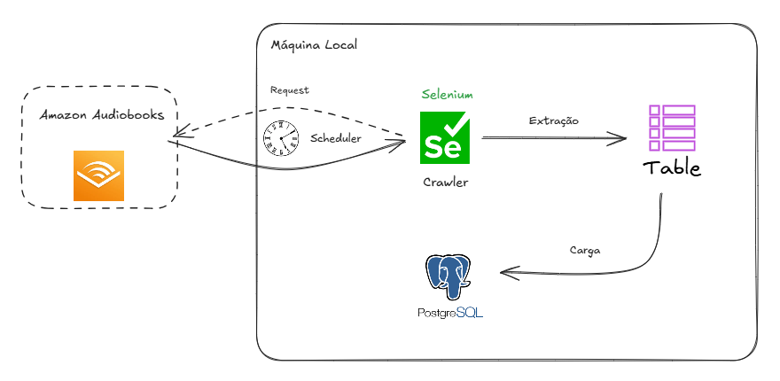
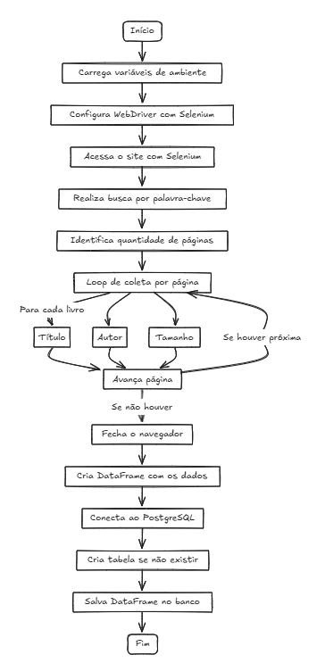

# Web-Scrapping

### Português (Brasil):
Olá! Este repositório foi criado para publicar alguns dos meus projetos de web scrapping, afim de ajudar pessoas que estão iniciando na ára a praticar através de projetos guiados.

Este repositório contém projetos divididos em vários níveis, iniciando com projetos usando apenas os pacotes do python requests e BeautifulSoup, até projetos mais complexos usando selenium e pacotes de integração com bancos de dados.

Sinta-se a vontade para fazer um *fork* no repositório e treinar com os projetos que disponibilizei aqui!

### English:
Hello! This repository was created to share some of my web scraping projects, with the goal of helping people who are starting out in the field to practice through guided projects.

This repository contains projects divided into various levels, starting with basic ones using only the Python packages requests and BeautifulSoup, and progressing to more complex projects using Selenium and database integration packages.

Feel free to fork the repository and practice with the projects I’ve shared here!

## Stack

python:
1. requests
2. bs4 (BeautifulSoup)
3. Selenium 
4. psycopg2 / oracledb
5. Pandas

# Flow and code
This is the flow of the information:

This is the representation of the code loop:

## Contact

 
   
 	
  
  
  

